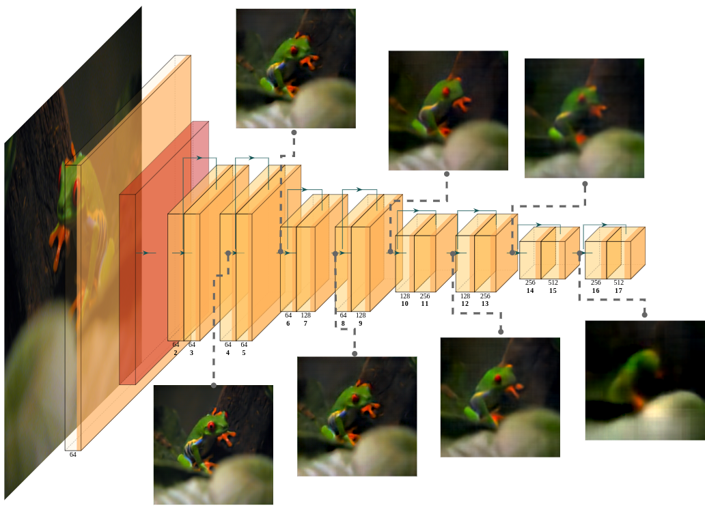
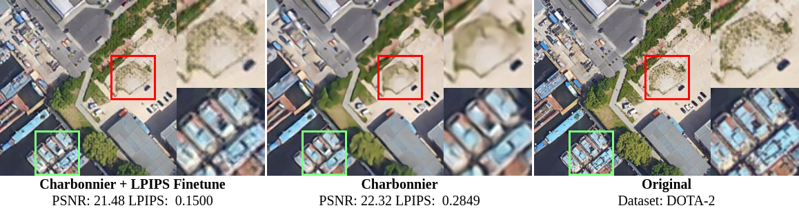

# THE FOOL
This is the Official Repository of `FOOL:  Addressing the Downlink Bottleneck in Satellite Computing with Neural Feature Compression`

I will gradually release the code, when the work is deeper into the review cycle, latest when I've received an acceptance notification.
Since the preprocessing of the dataasets and the preparation of the detection models is very intricate, I'm trying to figure out the logistics behind minimizing the amount of effort required to reproduce the experiments.
Moreover, if I think it's worthwhile to include the code for the systems related aspects (the codec in the compression pipeline should be exchangable) of this work, I'll create a separate repository, i.e., this repository will exclusively contain code for the core compression method.

Apolgies in advance, I wish I had the time and patience to create one of those very fancy and well-maintained repositories that are usable out of the box (For those I'm extremely grateful for, as they make excellent educational material).
However, if you are particularly interested in the work, and would like to have access to certain parts of the code, please write me a mail to **a.furutanpey@dsg.tuwien.ac.at**. I'd also be more than happy, to step through the relevant parts with you, especially, if you'd like to discuss potential collaboration for a follow-up.

# Updates

- The paper has finally been accepted to IEEE Transactions on Mobile Computing! I'm currently occupied with wrapping up my remaining work for my PhD, but I'll do my best to clean-up and release a (hopefully easy-to-use) version ASAP.
- If you are interested in this line of research, my related work on [Adversarial Robustness of Bottleneck Injected Deep Neural Networks for Task-Oriented Communication](https://arxiv.org/abs/2412.10265) has been accepted to IEEE ICMLCN 2025 


# Description
TODO

## Shallow Variational Bottlenecks 

The compression aspect of this work builds on the idea of Shallow Variational Bottlenecks introduced in  [FrankenSplit](https://github.com/rezafuru/FrankenSplit).
To briefly summarize, shallow layers of deep (foundational) models are excellent reconstruction targets, as the representation retains high mutual information with the original input.
Essentially, shallow layers may serve as a proxy to the image reconstruction task. 



Among the other contributions, The work shows that:
1) That we can map the compressed repesentation output by the encoder to different architectures that accomodate varying (earth observation) detection tasks (similiar to FrankenSplit) and
2) We can attach a image restoration model on top of a frozen encoder, to restore images that score competitively against state-of-the-art mid-quality Learned Image Compression (LIC) models. With an encoder that is as small as 350'000 parameters and no (autoregressive) context module we have up to 77% lower rate than LIC models with comparable quality levels. Notably, the restoration model is still smaller than most (efficient) LIC decoders.  



## Architecture
TODO


# Citation

[[Preprint]](https://arxiv.org/abs/2403.16677)

```bibtex
@misc{furutanpey2024fool,
      title={FOOL: Addressing the Downlink Bottleneck in Satellite Computing with Neural Feature Compression}, 
      author={Alireza Furutanpey and Qiyang Zhang and Philipp Raith and Tobias Pfandzelter and Shangguang Wang and Schahram Dustdar},
      year={2024},
      eprint={2403.16677},
      archivePrefix={arXiv},
      primaryClass={cs.LG}
}
```

# References

- Furutanpey, Alireza, Philipp Raith, and Schahram Dustdar. "FrankenSplit: Efficient Neural Feature Compression with Shallow Variational Bottleneck Injection for Mobile Edge Computing." arXiv preprint arXiv:2302.10681 (2023).
- Matsubara, Yoshitomo. "torchdistill: A modular, configuration-driven framework for knowledge distillation."
  Reproducible Research in Pattern Recognition: Third International Workshop, RRPR 2021, Virtual Event, January 11,
  2021, Revised Selected Papers. Cham: Springer International Publishing, 2021.
- Matsubara, Yoshitomo, et al. "SC2: Supervised compression for split computing." arXiv preprint arXiv:2203.08875 (
  2022).
- Wightman, Ross. "Pytorch image models." (2019).
- Bégaint, Jean, et al. "Compressai: a pytorch library and evaluation platform for end-to-end compression research."
  arXiv preprint arXiv:2011.03029 (2020).
- Gildenblat, Jacob. "contributors. Pytorch library for cam methods." (2021).
- Ballé, Johannes, et al. "Variational image compression with a scale hyperprior." arXiv preprint arXiv:1802.01436 (
  2018).
- Minnen, David, Johannes Ballé, and George D. Toderici. "Joint autoregressive and hierarchical priors for learned image
  compression." Advances in neural information processing systems 31 (2018).
- Ma, Gaocheng, Yinfeng Chai, Tianhao Jiang, Ming Lu, and Tong Chen. "TinyLIC-High efficiency lossy image compression method." arXiv preprint arXiv:2402.11164 (2024).
- Barroso-Laguna, Axel, Edgar Riba, Daniel Ponsa, and Krystian Mikolajczyk. "Key. net: Keypoint detection by handcrafted and learned cnn filters." In Proceedings of the IEEE/CVF international conference on computer vision, pp. 5836-5844. 2019.
- Jocher, G., Chaurasia, A., & Qiu, J. (2023). Ultralytics YOLO (Version 8.0.0) [Computer software]. https://github.com/ultralytics/ultralytics
